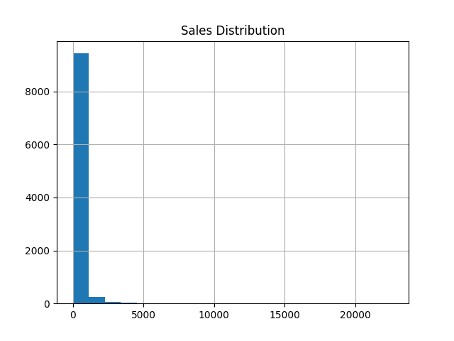
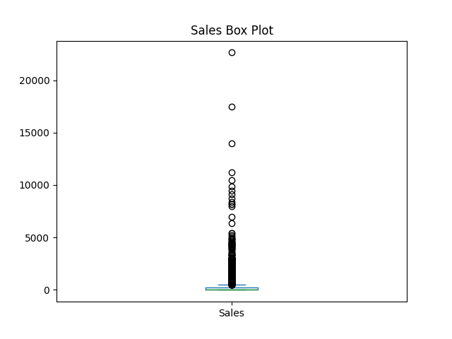
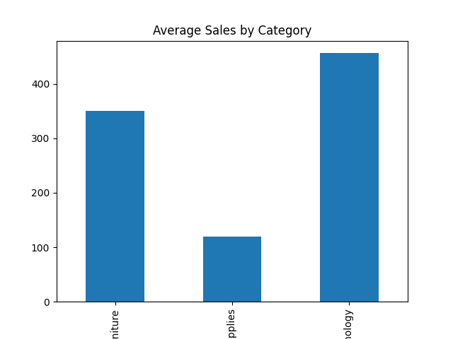
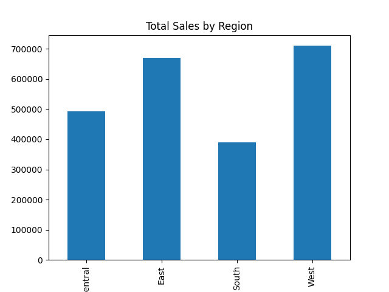

# 📊 Sales Data Visualization

## 📌 Objective

The objective of this project is to analyze and visualize sales data using Python, Pandas, Matplotlib, and Seaborn. The project focuses on transforming raw sales data into meaningful visual insights that help understand business performance, customer segments, regions, and product categories.

## 🛠 Technologies Used

* Python
* Pandas
* Matplotlib
* Seaborn
* Jupyter Notebook

## 📂 Dataset Information

* Total Records: 9,800
* Total Features: 18

### Categories

* Furniture
* Office Supplies
* Technology

### Regions

* South
* West
* Central
* East

### Customer Segments

* Consumer
* Corporate
* Home Office

## 📊 Visualizations

### Sales Distribution

### Sales Box Plot

### Average Sales by Category

### Total Sales by Region

### Top 10 Sub-Categories by Sales

## 🔍 Key Findings

* The dataset contains 9,800 sales records and 18 features.
* Office Supplies is the most frequently sold category with 5,909 records.
* Furniture has 2,078 records, while Technology has 1,813 records.
* The West region has the highest number of sales records (3,140).
* The South region has the lowest number of sales records (1,598).
* Consumer segment dominates the dataset with 5,101 records.
* Corporate segment contains 2,953 records.
* Home Office segment contains 1,746 records.
* Category-wise, region-wise, and segment-wise visualizations reveal important business trends and customer behavior patterns.

## 👨‍💻 Author
Devesh Vishwakarma
